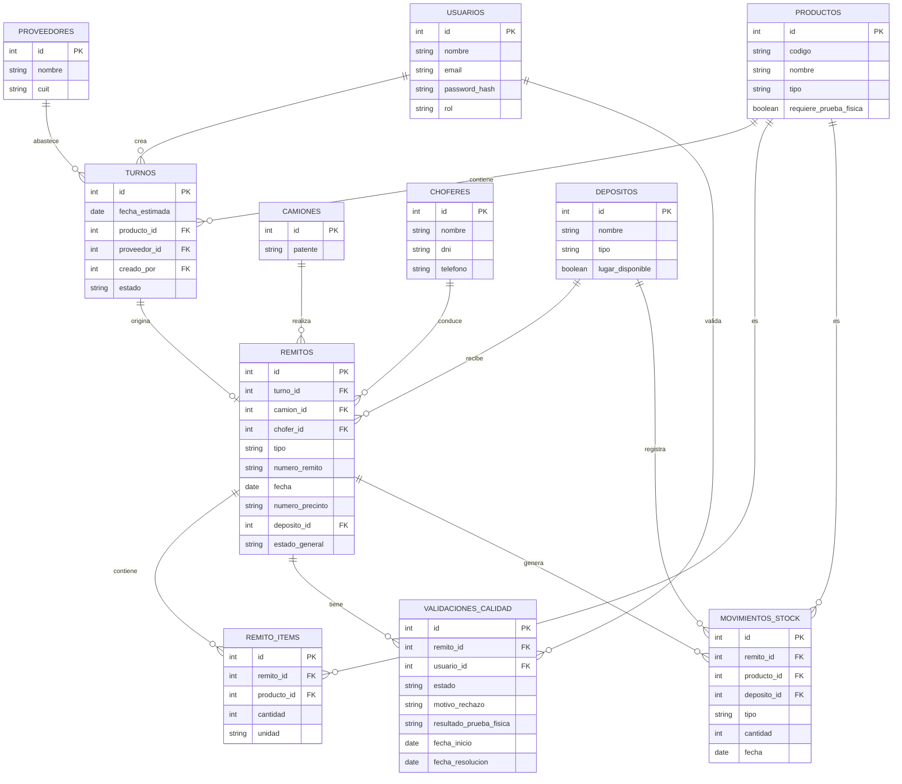

# Esquema de Base de Datos

## Notas sobre campos clave

- **`TURNOS.estado`**: `pendiente` / `confirmado` / `cancelado`. Lo carga el Analista de Insumos al coordinar una entrega con el proveedor, o la Guardia si el camión llega sin turno previo.
- **`VALIDACIONES_CALIDAD.estado`**: `pendiente` / `aprobado` / `rechazado`. Mientras está en `pendiente`, el camión "está en estudio".
- **`VALIDACIONES_CALIDAD.motivo_rechazo`**: se completa solo si `estado = rechazado`. Es lo que la Guardia consulta para informarle al chofer por qué no puede ingresar.
- **`VALIDACIONES_CALIDAD.resultado_prueba_fisica`**: solo aplica a productos con `requiere_prueba_fisica = true` (azúcar, leche en polvo); queda nulo para el resto.
- **`DEPOSITOS.lugar_disponible`**: lo controla el Depósito de Insumos antes de asignar una ubicación al remito.
- **`REMITOS.estado_general`**: resume el estado global del remito para la vista de Guardia (por ejemplo: `en_estudio_calidad`, `rechazado`, `esperando_lugar`, `listo_para_ingreso`, `ingresado`).
